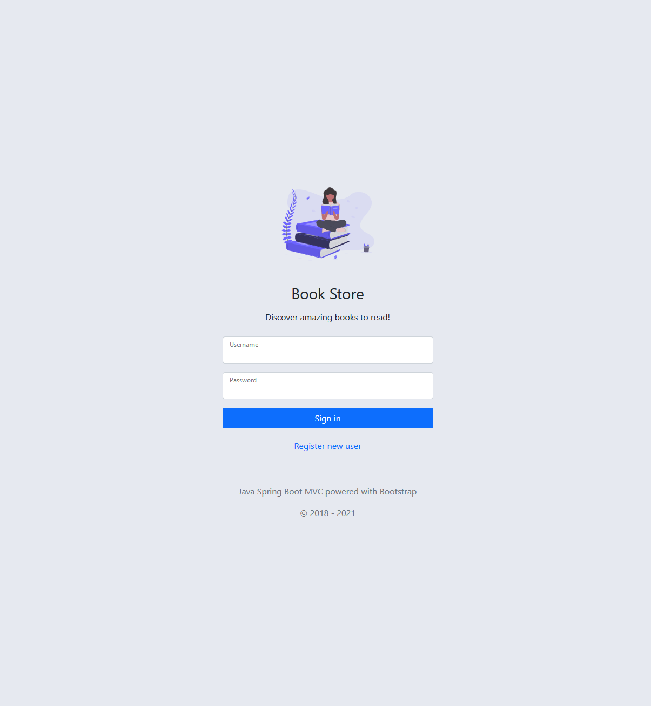
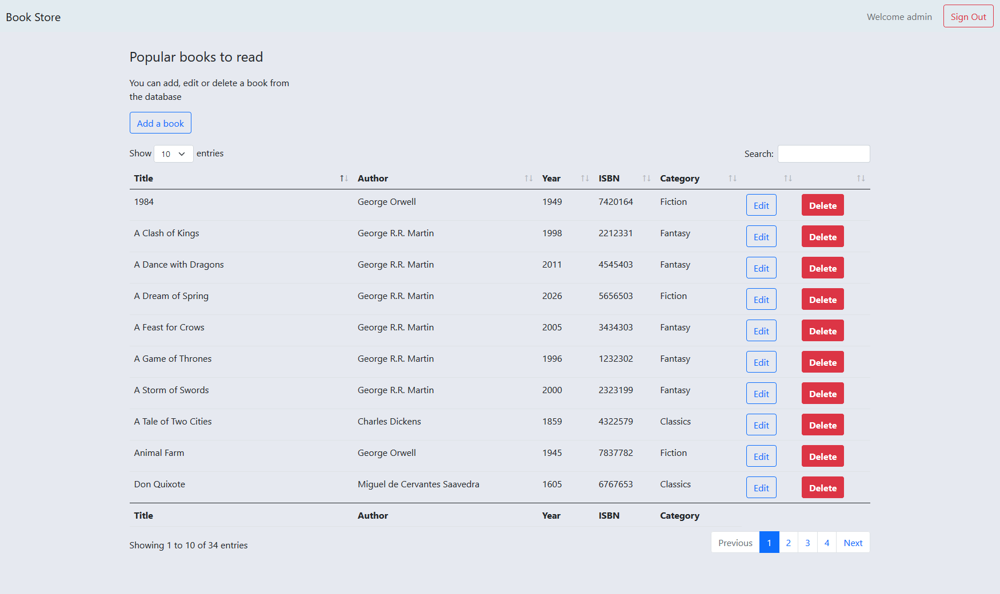

# Bookstore
> Java Spring Boot MVC app
* https://bookstoremvc.herokuapp.com/

## Features
The app has a list of books which appears the same for all users. 
* You can add, edit or delete books
* Create your own user to login or use the default credentials 

## Screenshots

## Technologies
* Java
* Spring Boot
* MVC
* Thymeleaf
* Bootstrap

## Status
Project is: _finished_
